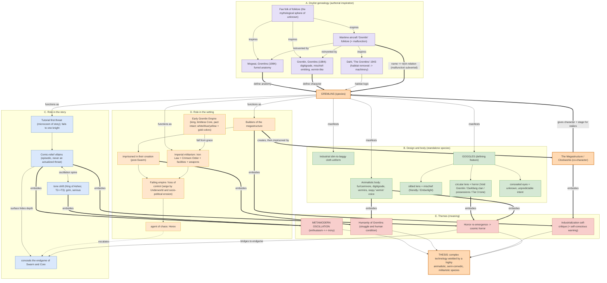

# Metamodern Gremlin of Cradle - Influence Map

Revised influence-mapping graph for the Gremlin species, grounded in
`src/lib/burning_stars.md` -> Final Chapter -> "A Metamodern Gremlin of Cradle"
(and the species' lore chapter IX). Supersedes the `gremlins.drawio` draft.

## Purpose

This version is organized as a character analysis tool.

The species sits at the center as the hub, and every other node is sorted into one of five analytical layers, with the authorial (Doylist) genealogy kept visually distinct from in-fiction (Watsonian) role and meaning.

## Edge vocabulary

_typed, not interchangeable_

| Edge | Meaning |
| ---- | ------- |
| `inspires` / `reinvented by` | Doylist lineage between real-world referents |
| `define anatomy` / `define character` / `habitat logic` | a referent contributes a specific component to the species |
| `manifests` | species -> a body/design trait it actually has in-game |
| `functions as` | species -> a role it performs in story or setting |
| `embodies` | a design or role -> the theme it carries |
| `oscillation spine` (bi-directional) | the metamodern comic <-> serious tension |

## The five layers

- **A. Doylist genealogy** - authorial inspiration (fae folklore -> wartime aircraft Gremlin -> Dahl -> Gremlins 1984), and the precise component each donates.
- **B. Design and body** - the standalone species: animalistic anatomy, vermin voice, industrial uniform and its properties.
- **C. Role in the story** - tutorial first-threat, comic-relief villainy followed by the Swarm-Herex-Core endgame, and the tone shift that creates oscillation.
- **D. Role in the setting** - builders imprisoned in their own megastructure; imperial militarism (Iron Law, Crimson Order); Early Empire fall from grace; loss of control motif.
- **E. Themes** - metamodern oscillation, the humanity of Gremlins, industrialization self-critique, horror actualization.

