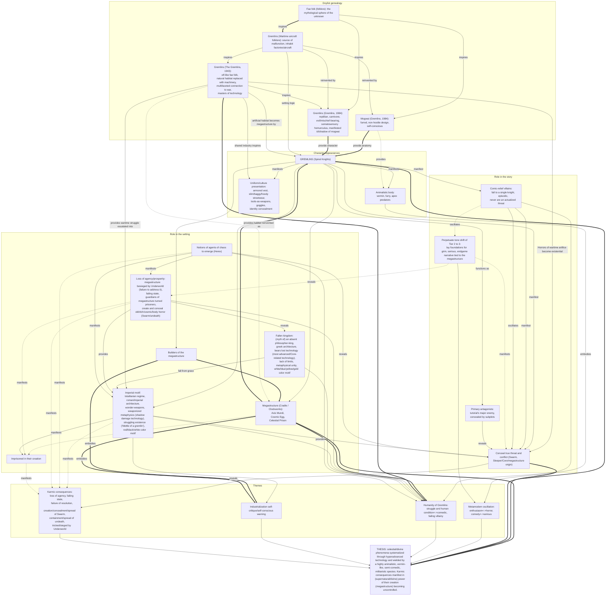

# Metamodern Gremlin of Cradle: Influence Map

<!--Here we attempt to truncate the essay, the setting, as being built from archetypal material, so stripping the lore does not expose neutral structure (albeit it would be fitting but more verbose), exposing the archetypal layer, whose traditional names/tokens are mythologems. Mythologems behave in this case as the densest tokens available for pattern-shaped emotionally-charged by the player meaning proposed in the essay.-->

